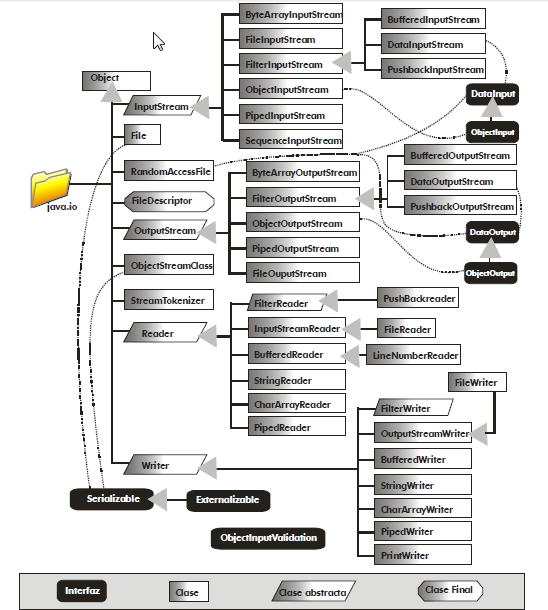
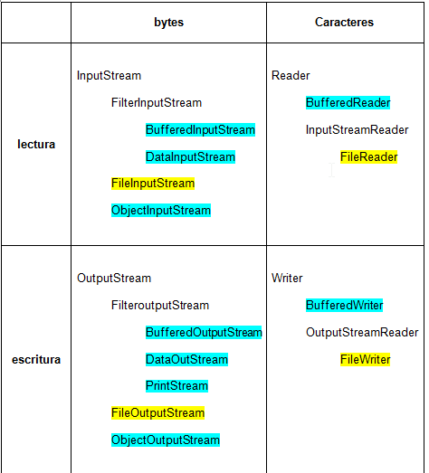

# STREAMS (Flujos de datos o Secuencias)

## .1 Manejo de archivos. Acceso a ficheros

### .1.1 Streams y Ficheros

### *¿Qué es un Stream?*
- Es un **flujo de datos** mediante el cual se comunican el **programa** y el **origen/destino** de la información. En los Streams, los datos siempre se **transmiten** y procesan **secuencialmente**, es decir, uno tras otro de manera ordenada.
    1. Flujo de Entrada (comunicación programa-origen)
    2. Flujo de Salida (comunicación programa-destino)

- El **origen/destino** desde (o hacia) el que fluyen los Streams es, a menudo, un **fichero** en algún punto del sistema de ficheros de un **dispositivo de almacenamiento** físico(Como Disco duro, USB, etc.).

### *¿Porqué el uso de ficheros?*

- Para **almacenar** la información de forma **permanente** en algún dispositivo de almacenamiento, y no en RAM, que es temporal.
Para hacerlo necesitamos el uso de Streams.
    - Modos de **acceso a ficheros**:
        - Modo **Escritura**
        - Modo **Lectura**
    - Modos de **acceso a datos** del fichero:
        - Acceso **secuencial** (De principio a fin)
        - Acceso **directo** o Aleatorio (A partir de una posición determinada)
  

Las **clases** vinculadas a los flujos Entrada y Salida (E/S) se encuentran en el **paquete `java.io`**

**Excepción** vinculada y definida en el mismo paquete: **`IOException`**

### .1.2 Formas de abordar los streams:
1. Flujos de **Bytes**
    - **Uso general:** envío de información a través de la red. 
    - **Clases:** `InputStream` y `OutputStream` (Abstractas).
2. Flujos de **Caracteres**
    - **Uso general:** lectura/escritura de datos "humana".
    - **Clases:** `Reader` y `Writer` (Abstractas).

### *Clases fundamentales:*

  

### .1.3 Otras Clases
- `File` - Permite referirse a ficheros y directorios en el sistema de ficheros del ordenador(Pasando ruta por parámetro).
- `RandomAccesFile` - Permite el acceso directo a cualquier posición de un fichero de texto.

## .2 Filtros: Buffer (Modificador de flujo o Filtro)

### .2.1 Buffer
### *¿Qué es un Buffer?*
- Un buffer es un modificador de flujo, es decir, altera el comportamiento normal del Stream, y lo hace para mejorar el rendimiento en la lectura/escritura de grandes cantidades de datos.

### *¿Cómo lo hace?*
- **Lectura:** Se cargan en memoria más datos de los necesarios en un primer momento, para que no sea necesario volver a acceder a  todos los datos desde el dispositivo de almacenamiento.
- **Escritura:** Los datos se van guardando en memoria y no se vuelcan hasta que hay una cantidad suficiente para el correcto funcionamiento.

**Clases:** `BufferedReader` ,  `BufferedWriter` , (`Buffered...`)

### .2.2 Otros Filtros
**Clases:**
- `DataInputStream` - Lectura de tipos primitivos, considerando los datos leidos como tipos de datos, independientemente de la
máquina.
- `DataOutputStream` - Escritura de tipos primitivos, considerando los datos escritos como tipos de datos, independientemente de la máquina.
- `PrintStream` - Da formato a la salida. (Ej.: Salida estándar `System.out`)

## .3 Serialización
### *¿En qué consiste?*
- La serialización consiste en **transformar un objeto** Java en una **secuencia de bytes** para poder ser enviados correctamente mediante un stream.

### *OJO*
- Sólo los objetos de clases que implementen la interface java.io.`Serializable` pueden ser serializados.
- La interfaz `Serializable` sólo sirve para “marcar” las clases que pueden ser serializadas.

**Clases:**
- Entrada: `ObjectInputStream` (Parametros: objeto de la clase `FileInputStream` para leer y deserializar objetos que vienen de un fichero (mediante stream))
    - Para deserializar objetos después de leerlos a través del stream de entrada se llama al método `readObject()`
- Salida: `ObjectOutputStream` (Parametros: objeto de la clase `FileOutputStream` para dirigir los objetos a un fichero mediante stream)
    - Para serializar objetos y escribirlos a través del stream de salida se llama al método `writeObject()`

### 3.1 serialVersionUID
Por defecto, el compilador Java establece un serialVersionUID a cada programa. Por lo que si cambiamos algo del código, se considera una versión diferente, y asigna un serialVersionUID diferente. Esto puede dar problemas cuando tenemos nuestro programa distribuido y no todo el mundo ha actualizado a la última versión, ya que no podrían recibir o enviar objetos serializados con una serialVersionUID diferente. Hay 2 formas de abordarlo:
- Asignando el valor que queramos: `private static final long serialVersionUID = 1L;`
- Generando un numero con la herramienta serialver del JDK:
    - Escribimos en consola: `serialver` Clase (donde Clase es el nombre del archivo.class de la clase a la que queremos asignarle una serialVersion).
    - **OJO:** Debemos estar en la carpeta que contenga los archivos compilados .class en cuestión.

